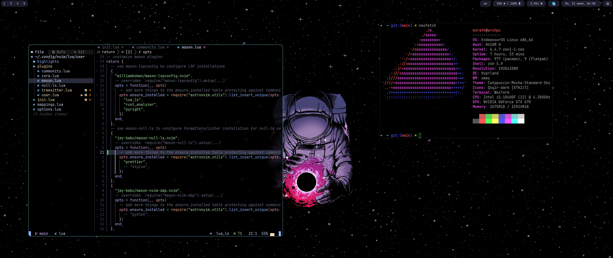

# Install
## For ArchLinux
Not complete yet...
```bash
$ yay -S hyprland wezterm waybar hyprshot firefox swww
```

# Hyprland
## Keybinds

### Basic
- ```MOD + SHIFT + C``` kill active window
- ```MOD + SHIFT + E``` exit window manager
- ```MOD + F``` toggle floating mode for active window
- ```MOD + M``` toggle fullscreen for active window
- ```MOD + B``` toggle bar visibility

### Focus and a movement
- ```MOD + [hjkl]``` move focus according to vim-style direction
- ```MOD + SHIFT + [hjkl]``` swap active window with next in direction
- ```MOD + [0-9]``` switch between workspaces
- ```MOD + SHIFT + [0-9]``` move active window to a workspace

### Layout
- ```MOD + Y``` use __master__ layout
- ```MOD + SHIFT + Y``` use __dwindle__ layout
- ```MOD + U``` toggle split for __dwindle__ layout

### Launch apps
- ```MOD + Return``` spawn terminal
- ```MOD + P``` spawn apps launcher
- ```MOD + CTRL + L``` spawn firefox

### Screenshots
- ```PRINT``` screenshot a region
- ```SHIFT + PRINT``` screenshot a monitor
- ```MOD + PRINT``` screenshot a window
